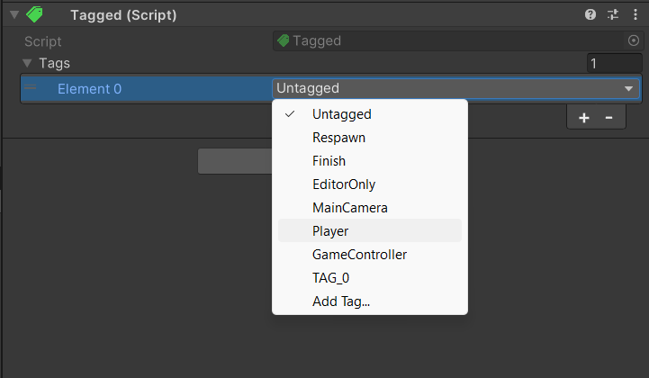
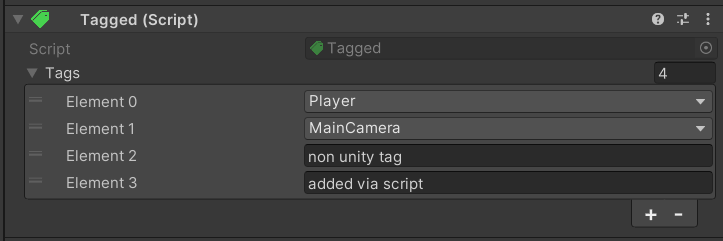

# Tagged
Flexible and easy to use tag system for Unity supporting GameObjects, Components, and interfaces (aka anything you can edit or derive from) with multiple or no tags. 

This package includes a source generator for compile-time constant tags that automatically update when necessary, a custom attribute for selecting one or multiple existing tags from the inspector, abstraction-based design with interfaces for easy expansion, a MonoBehaviour implementation of the interface for quick entry and optional extension methods for convenience.  

Tagged works similiar to other common Unity tag system implementations by using a custom component as its default implementation. Main difference of this package is, it is based around interfaces to support tagging everything such as ScriptableObjects, MonoBehaviours and even regular C# objects.

## Installation
Having the necessary scripts on the project is all that is needed. This package is best installed with the Unity Package Manager via its git URL.

1. Open the Unity Package Manager.
2. Select "Add package from git URL..."  
3. Paste ` https://github.com/SametHope/Tagged.git#main ` as the URL.
4. Done.

## Removal
This package defines its own assembly definitions for runtime, test and editor environments and does not create any new files so removing it is as easy as it gets.  
Removing the package from the Unity Package Manager should be enough to get rid of everything.

# Usage
## Tag Selection From The Inspector  
Use `TaggedAttribute` in order to get a custom property drawer on the inspector from which you can select existing tags on the project or add new tags.
```cs
[Tagged] public string Example; // Use for a single string property
[field: Tagged, SerializeField] public string Example { get; private set; } // Use with fields 

[Tagged] public List<string> Example; // Use with lists
[Tagged] public string[] Example // Use with arrays
```

## Source-Generated Tags
Beside being the default MonoBehaviour implementation for `ITagged`, `Tagged` contains constant string values for tags in the project.  
Generation can be customized in [TaggedSourceGenerator.cs](Editor/TaggedSourceGenerator.cs) to add/remove custom prefixes, change how special characters handled and how often should tags be checked for differences.
```cs
// TPlayer and TEnemy have been created automatically and are syncronized with projects tags
string playedTag = Tagged.TPlayer;
string myCustomTag = Tagged.TEnemy;
```

## Custom Component
`Tagged` is the default implementation and example of `ITagged`s usage. It has a list of tags to be interacted from the inspector. Internally, a hashset is used and syncronized with it for fast comparisons.

Select tags you want from the dropdown.  
  

## Tagged API
Static methods are present on `Tagged` to interact with `ITagged` implementations, GameObjects/Components and regular objects.  
  
**ITagged calls** directly interact with the object with the interface.  
**GameObject and Component calls** use `TryGetComponent<ITagged>()` internally to try and get a component with `ITagged`.  
**Object calls** try to cast the target to `ITagged`, `GameObject` and `Component` in that order to try and get a instance of `ITagged`.  

`AddTags` calls with `GameObject` or `Component` targets **will add `Tagged` component** if the object doesn't have it. 
If a call fails due to `target` or `tags` being null, it will **fail silently** and return false.

```cs
// Returns true if all specified tags are present
public static bool IsTagged(ITagged target, params string[] tags); 
public static bool IsTagged(GameObject target, params string[] tags);
public static bool IsTagged(Component target, params string[] tags);
public static bool IsTagged(object target, params string[] tags);

// Returns true if at least one specified tag has been added
public static bool AddTags(ITagged target, params string[] tags);
public static bool AddTags(GameObject target, params string[] tags);
public static bool AddTags(Component target, params string[] tags);
public static bool AddTags(object target, params string[] tags);

// Returns true if at least one specified tag has been removed
public static bool RemoveTags(ITagged target, params string[] tags);
public static bool RemoveTags(GameObject target, params string[] tags);
public static bool RemoveTags(Component target, params string[] tags);
public static bool RemoveTags(object target, params string[] tags);
```

## Tagged Extensions API
To not type `Tagged.IsTagged(gameobject, TPlayer)` or similiar lines every time Tagged API is needed, there are extension methods defined within [TaggedExtensions.cs](Runtime/TaggedExtensions.cs) that are enabled by default.  
These extensions can be disabled by adding `DISABLE_TAGGED_EXTENSIONS` preprocessor directive to the player options on the project settings in order to not bloat the project if you are not going to use it.  

There is a direct equivalent of every Tagged API call as a extension that internally calls the Tagged API. 
```cs
// Returns true if all specified tags are present
public static bool IsTagged(this ITagged target, params string[] tags); 
public static bool IsTagged(this GameObject target, params string[] tags);
public static bool IsTagged(this Component target, params string[] tags);
public static bool IsTagged(this object target, params string[] tags);

// Returns true if at least one specified tag has been added
public static bool AddTags(this ITagged target, params string[] tags);
public static bool AddTags(this GameObject target, params string[] tags);
public static bool AddTags(this Component target, params string[] tags);
public static bool AddTags(this object target, params string[] tags);

// Returns true if at least one specified tag has been removed
public static bool RemoveTags(this ITagged target, params string[] tags);
public static bool RemoveTags(this GameObject target, params string[] tags);
public static bool RemoveTags(this Component target, params string[] tags);
public static bool RemoveTags(this object target, params string[] tags);
```

## Custom Objects
Anything that implements `ITagged` interface is considered equal by the system.  

Here is how the interface is defined (with xml documentation removed).  
You can implement this interface on scriptable objects or plain old C# objects to use them with this system.  
```cs
public interface ITagged
{
  bool IsTagged(params string[] tags);
  bool AddTags(params string[] tags);
  bool RemoveTags(params string[] tags);
}
```
Here is an example implementation of the interface taken (almost) directly from bottom of the [TestRunner.cs](Tests/TestRunner.cs)
```cs
public class ExampleTaggedImplementation : ITagged
{
  private HashSet<string> _tagSet;

  public ExampleTaggedPOCO()
  {
      _tagSet = new HashSet<string>();
  }

  public bool AddTags(params string[] tags)
  {
      if(tags == null || tags.Length == 0) return false;
      bool addedAtLeastOne = true;
      foreach(var tag in tags)
      {
          addedAtLeastOne &= _tagSet.Add(tag);
      }
      return addedAtLeastOne;
  }

  public bool IsTagged(params string[] tags)
  {
      if(tags == null || tags.Length == 0) return false;
      foreach(var tag in tags)
      {
          if(!_tagSet.Contains(tag))
          {
              return false;
          }
      }
      return true;
  }

  public bool RemoveTags(params string[] tags)
  {
      if(tags == null || tags.Length == 0) return false;
      bool removedAtLeastOne = true;
      foreach(var tag in tags)
      {
          removedAtLeastOne &= _tagSet.Remove(tag);
      }
      return removedAtLeastOne;
  }
}
```

## Custom Tags
It is possible to use Tagged without using any Unity tags as you can add and remove any string as a tag and use them as such. In fact, `Tagged` component supports displaying and editing such tags on the inspector with the `TaggedAttribute`.  
  
However these custom non-Unity tags (aka just regular strings) are not possible to add to the `Tagged` component via the inspector and must be handled manually as this component is intended for usage with Unity tags.  

I highly discourage using strings that are not defined and used as constants consistently. Best way to follow those practices is to keep track of tags with the tag manager of Unity which is the intended way of using this package.

# Example/Intended Usage
Below is a code snippet showcasing how a practical usage of the Tagged might look like.  
This code is taken from a projectile script that is shared between different types of projectiles in a game. We can check for specific flags to implement special logic for them with ease. In this examples case, we do nothing, purposefully. 
```cs
protected virtual void HandleDamageReceiver(IDamageReceiver receiver)
{
  if(this.IsTagged(Tagged.TPlayerProjectile) && receiver.IsTagged(Tagged.TPlayer))
  {
    // Do not inflict player self-damage
    return;
  }
  else if(this.IsTagged(Tagged.TEnemyProjectile) && receiver.IsTagged(Tagged.TEnemy))
  {
    // Do not inflict enemy self-damage
    return;
  }
  receiver.ReceiveDamageFrom(this);
  Destroy(gameObject);
}
```

# Final Notes
These notes don't really fit in any other titles so they go here. That doesn't mean they are not important.
- Given anything can be tagged, this system does not include a way to track and keep a list of every tagged object. It is the users responsibility to track their objects if they want to do it.  
Tagged class is not sealed and is partial, it is possible to add a dictionary to keep track of all tagged objects and extra methods that use the dictionary for super fast lookups with the cost being extra work of adding and removing objects to that dictionary when it is necessary.
- I do not recommend doing tag checks on update loops unless you know what you are doing as a tag related operation can scale from a quick hashset comparison to multiple object casts and a TryGetComponent call.
- This tag system doesn't use GameObjects' singular tag that Unity enforces in any way.
- Unlike what is shown in examples, all accessible API is documented with xml and is supported with comments when necessary.
- `Tagged` component exposes voids for Usage with Unity Events for adding and removing tags, just in case.
